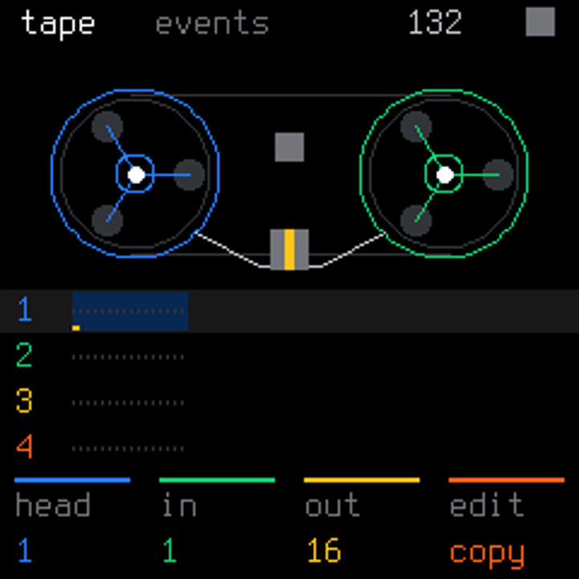

# ORBIT web emulator

A fork of [sabliran/sloop-web-emu](https://github.com/sabliran/sloop-web-emu) that runs the actual [ORBIT FM-1 firmware](https://github.com/dspaudio/orbit) as WebAssembly inside an AudioWorklet.

**ORBIT 0.2.1 is the default firmware.** SLOOP and Felucca remain available as the original upstream comparison binaries. Use the firmware selector at the top left to switch. Each firmware has its own locally stored flash image.

## Run the compiled emulator

The `docs/` directory contains the compiled module and static application. Serve it locally:

```sh
python3 -m http.server 8787 --directory docs
```

Open http://localhost:8787 and press POWER to start audio. AudioWorklet requires HTTPS or localhost; opening the HTML file directly is insufficient.

## Rebuild ORBIT

Requirements: clang + lld with wasm32 support, Python 3, numpy and Pillow. No Emscripten or FM-1 vendor SDK is needed for this browser build.

```sh
git clone https://github.com/dspaudio/orbit ../orbit
git -C ../orbit checkout "$(cat ORBIT_REVISION)"
python3 -m pip install -r ../orbit/requirements.txt
ORBIT=../orbit ./build.sh
node tests/orbit-wasm.mjs
node tests/orbit-worklet.mjs
cp dist/*.wasm dist/*.js dist/*.html dist/*.png dist/*.webmanifest dist/build-info.json docs/
```

`ORBIT_REVISION` pins the published source revision. `build-info.json` records the checkout used for the build. The original comparison binaries are copied from the fork's `docs/` directory and are not rebuilt by this command.

## Input corrections

HOME now briefly displays the engine and actual loaded preset when PRESETS is turned. The preset bank selects individual sounds; all 68 factory mappings resolve. Short button presses are queued across firmware UI frames, so fast SAVE/EDIT/SEQ taps are recognised. The AudioWorklet regression test checks a rapid SAVE press/release followed by a preset detent.

## ORBIT controls

- HOME: event Tape. KNOB1 sets the head; KNOB2/3 set the inclusive start/end; KNOB4 selects COPY or LIFT.
- OCT−: copy/lift the selection. OCT+: drop at the head, overwriting existing events. ALGORITHM selects the track.
- EDIT / ENV / GLO / SEQ: synth / envelope / mixer / step sequencer.
- Click the keybed to play. PLAY and REC use the existing transport and live recording.
- Computer keys: Z/X = OCT−/OCT+, 1–0 = FX/SCL/ENV/LFO/EDIT/GLO/HOME/SAVE/ARP/SEQ, Space = PLAY, R = REC, arrows = SELECT/ALGORITHM.
- Knobs accept mouse drag or scroll. MIDI keyboard input uses the upstream emulator's mapping.

## Validation and progress

- ORBIT wasm32 build: PASS (clang 18.1.3 + lld).
- WebAssembly smoke test: PASS; module size 1,058,655 bytes, no imports.
- Actual synth output: finite, non-silent PCM; observed peak 0.4307.
- Flash: 458,752-byte image, 15 storage writes, restored image preserved across boot.
- Browser AudioWorklet boot and HOME rendering: verified on the published site.



## Test scope and limitations

The WebAssembly smoke test checks boot and framebuffer rendering, panel and encoder input, sequencer and editor screens, non-silent finite PCM, isolated autosave writes and reboot with a restored flash image. These checks run the compiled ORBIT C engine; they do not establish real FM-1 boot safety, memory budget or IRQ timing.

Browser projects and settings save locally in IndexedDB. USB audio, SysEx/editor communication and user sample upload/CHOP are not implemented in the emulator HAL. Bluetooth pairing/audio is not implemented. Avoid the hardware calibration screen, which can stall the worklet. The divide-by-zero trap mitigation belongs to the hardware HAL and cannot be validated by this browser HAL.

ORBIT Tape stores note and drum events, rather than long recorded PCM audio. See the [firmware README](https://github.com/dspaudio/orbit) for source screenshots, progress and hardware build instructions.

## Origin and licensing

The emulator is forked from `sabliran/sloop-web-emu` at `bbfd8e5b3bfc452520f61afb0d94e2fdfe93fd9d`; its history and notices are retained. The original README is preserved in [README-UPSTREAM.md](README-UPSTREAM.md). ORBIT derives from SLOOP/Felucca. Software is GPL-3.0-only; firmware asset notices remain in the linked source repository.
